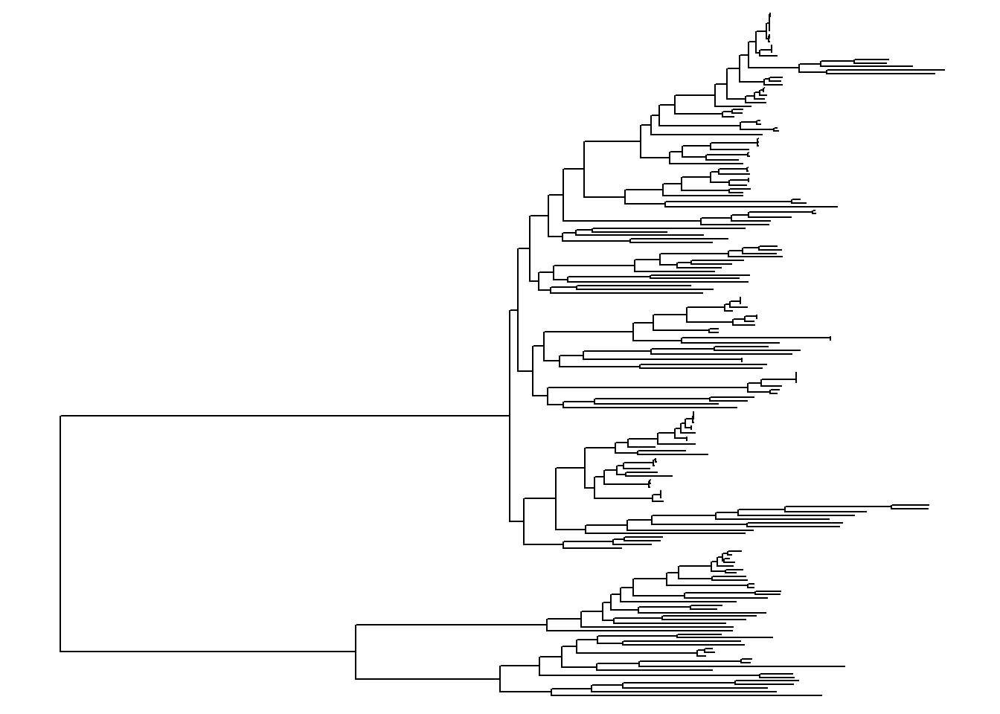
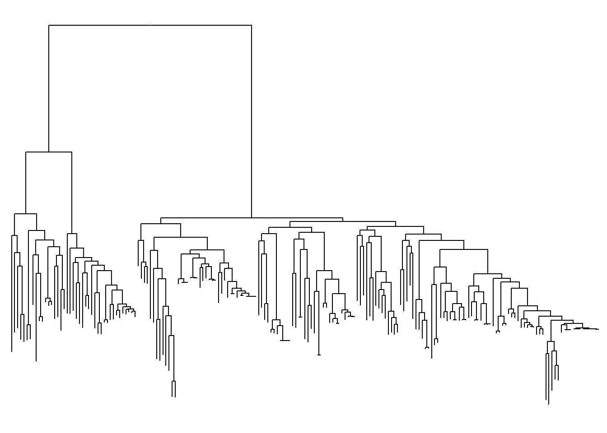
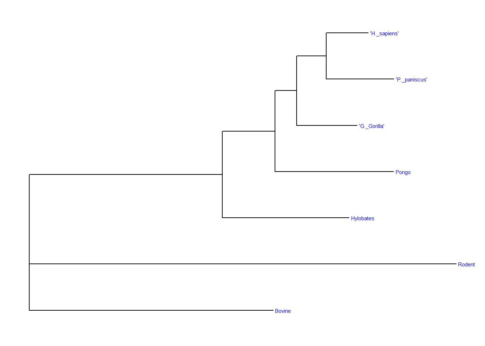
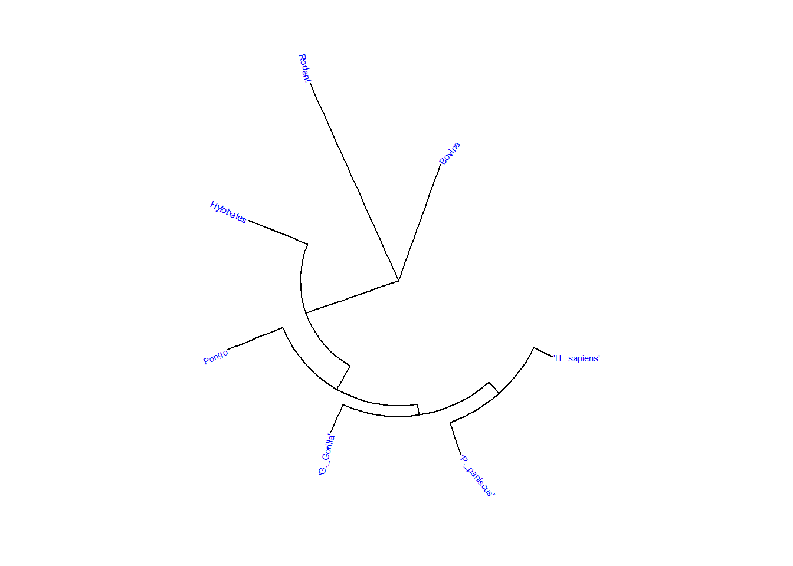

## Phylogenetic Analysis and Visualization

## Installing packages and adding to the library


::: {.cell}

```{.r .cell-code}
#install.packages("ape")

#if (!require("BiocManager", quietly = TRUE))
    #install.packages("BiocManager")

#BiocManager::install("treeio")

#if (!require("BiocManager", quietly = TRUE))
    #install.packages("BiocManager")

#BiocManager::install("ggtree")

#if (!require("BiocManager", quietly = TRUE))
    #install.packages("BiocManager")

#BiocManager::install("SGSeq")
```
:::


Installing required packages.


::: {.cell}

```{.r .cell-code}
library(rbioinfcookbook)
library(SGSeq)
```

::: {.cell-output .cell-output-stderr}

```
Loading required package: IRanges
```


:::

::: {.cell-output .cell-output-stderr}

```
Loading required package: BiocGenerics
```


:::

::: {.cell-output .cell-output-stderr}

```

Attaching package: 'BiocGenerics'
```


:::

::: {.cell-output .cell-output-stderr}

```
The following objects are masked from 'package:stats':

    IQR, mad, sd, var, xtabs
```


:::

::: {.cell-output .cell-output-stderr}

```
The following objects are masked from 'package:base':

    anyDuplicated, aperm, append, as.data.frame, basename, cbind,
    colnames, dirname, do.call, duplicated, eval, evalq, Filter, Find,
    get, grep, grepl, intersect, is.unsorted, lapply, Map, mapply,
    match, mget, order, paste, pmax, pmax.int, pmin, pmin.int,
    Position, rank, rbind, Reduce, rownames, sapply, saveRDS, setdiff,
    table, tapply, union, unique, unsplit, which.max, which.min
```


:::

::: {.cell-output .cell-output-stderr}

```
Loading required package: S4Vectors
```


:::

::: {.cell-output .cell-output-stderr}

```
Loading required package: stats4
```


:::

::: {.cell-output .cell-output-stderr}

```

Attaching package: 'S4Vectors'
```


:::

::: {.cell-output .cell-output-stderr}

```
The following object is masked from 'package:utils':

    findMatches
```


:::

::: {.cell-output .cell-output-stderr}

```
The following objects are masked from 'package:base':

    expand.grid, I, unname
```


:::

::: {.cell-output .cell-output-stderr}

```

Attaching package: 'IRanges'
```


:::

::: {.cell-output .cell-output-stderr}

```
The following object is masked from 'package:grDevices':

    windows
```


:::

::: {.cell-output .cell-output-stderr}

```
Loading required package: GenomicRanges
```


:::

::: {.cell-output .cell-output-stderr}

```
Loading required package: GenomeInfoDb
```


:::

::: {.cell-output .cell-output-stderr}

```
Loading required package: Rsamtools
```


:::

::: {.cell-output .cell-output-stderr}

```
Loading required package: Biostrings
```


:::

::: {.cell-output .cell-output-stderr}

```
Loading required package: XVector
```


:::

::: {.cell-output .cell-output-stderr}

```

Attaching package: 'Biostrings'
```


:::

::: {.cell-output .cell-output-stderr}

```
The following object is masked from 'package:base':

    strsplit
```


:::

::: {.cell-output .cell-output-stderr}

```
Loading required package: SummarizedExperiment
```


:::

::: {.cell-output .cell-output-stderr}

```
Loading required package: MatrixGenerics
```


:::

::: {.cell-output .cell-output-stderr}

```
Loading required package: matrixStats
```


:::

::: {.cell-output .cell-output-stderr}

```
Warning: package 'matrixStats' was built under R version 4.4.3
```


:::

::: {.cell-output .cell-output-stderr}

```

Attaching package: 'MatrixGenerics'
```


:::

::: {.cell-output .cell-output-stderr}

```
The following objects are masked from 'package:matrixStats':

    colAlls, colAnyNAs, colAnys, colAvgsPerRowSet, colCollapse,
    colCounts, colCummaxs, colCummins, colCumprods, colCumsums,
    colDiffs, colIQRDiffs, colIQRs, colLogSumExps, colMadDiffs,
    colMads, colMaxs, colMeans2, colMedians, colMins, colOrderStats,
    colProds, colQuantiles, colRanges, colRanks, colSdDiffs, colSds,
    colSums2, colTabulates, colVarDiffs, colVars, colWeightedMads,
    colWeightedMeans, colWeightedMedians, colWeightedSds,
    colWeightedVars, rowAlls, rowAnyNAs, rowAnys, rowAvgsPerColSet,
    rowCollapse, rowCounts, rowCummaxs, rowCummins, rowCumprods,
    rowCumsums, rowDiffs, rowIQRDiffs, rowIQRs, rowLogSumExps,
    rowMadDiffs, rowMads, rowMaxs, rowMeans2, rowMedians, rowMins,
    rowOrderStats, rowProds, rowQuantiles, rowRanges, rowRanks,
    rowSdDiffs, rowSds, rowSums2, rowTabulates, rowVarDiffs, rowVars,
    rowWeightedMads, rowWeightedMeans, rowWeightedMedians,
    rowWeightedSds, rowWeightedVars
```


:::

::: {.cell-output .cell-output-stderr}

```
Loading required package: Biobase
```


:::

::: {.cell-output .cell-output-stderr}

```
Welcome to Bioconductor

    Vignettes contain introductory material; view with
    'browseVignettes()'. To cite Bioconductor, see
    'citation("Biobase")', and for packages 'citation("pkgname")'.
```


:::

::: {.cell-output .cell-output-stderr}

```

Attaching package: 'Biobase'
```


:::

::: {.cell-output .cell-output-stderr}

```
The following object is masked from 'package:MatrixGenerics':

    rowMedians
```


:::

::: {.cell-output .cell-output-stderr}

```
The following objects are masked from 'package:matrixStats':

    anyMissing, rowMedians
```


:::

```{.r .cell-code}
library(ape)
```

::: {.cell-output .cell-output-stderr}

```
Warning: package 'ape' was built under R version 4.4.3
```


:::

::: {.cell-output .cell-output-stderr}

```

Attaching package: 'ape'
```


:::

::: {.cell-output .cell-output-stderr}

```
The following object is masked from 'package:Biostrings':

    complement
```


:::

```{.r .cell-code}
library(treeio)
```

::: {.cell-output .cell-output-stderr}

```
treeio v1.30.0 Learn more at https://yulab-smu.top/contribution-tree-data/

Please cite:

LG Wang, TTY Lam, S Xu, Z Dai, L Zhou, T Feng, P Guo, CW Dunn, BR
Jones, T Bradley, H Zhu, Y Guan, Y Jiang, G Yu. treeio: an R package
for phylogenetic tree input and output with richly annotated and
associated data. Molecular Biology and Evolution. 2020, 37(2):599-603.
doi: 10.1093/molbev/msz240
```


:::

::: {.cell-output .cell-output-stderr}

```

Attaching package: 'treeio'
```


:::

::: {.cell-output .cell-output-stderr}

```
The following object is masked from 'package:Biostrings':

    mask
```


:::

```{.r .cell-code}
library(ggplot2)
```

::: {.cell-output .cell-output-stderr}

```
Warning: package 'ggplot2' was built under R version 4.4.3
```


:::

::: {.cell-output .cell-output-stderr}

```

Attaching package: 'ggplot2'
```


:::

::: {.cell-output .cell-output-stderr}

```
The following object is masked from 'package:SGSeq':

    annotate
```


:::

```{.r .cell-code}
library(ggtree)
```

::: {.cell-output .cell-output-stderr}

```
ggtree v3.14.0 Learn more at https://yulab-smu.top/contribution-tree-data/

Please cite:

Guangchuang Yu, Tommy Tsan-Yuk Lam, Huachen Zhu, Yi Guan. Two methods
for mapping and visualizing associated data on phylogeny using ggtree.
Molecular Biology and Evolution. 2018, 35(12):3041-3043.
doi:10.1093/molbev/msy194
```


:::

::: {.cell-output .cell-output-stderr}

```

Attaching package: 'ggtree'
```


:::

::: {.cell-output .cell-output-stderr}

```
The following object is masked from 'package:ape':

    rotate
```


:::

::: {.cell-output .cell-output-stderr}

```
The following object is masked from 'package:Biostrings':

    collapse
```


:::

::: {.cell-output .cell-output-stderr}

```
The following object is masked from 'package:IRanges':

    collapse
```


:::

::: {.cell-output .cell-output-stderr}

```
The following object is masked from 'package:S4Vectors':

    expand
```


:::
:::


Adding necessary packages to the library for ease of future access.

## Reading and writing trees with ape and treeio


::: {.cell}

```{.r .cell-code}
newick_file_path <- fs::path_package("extdata", "mammal_tree.nwk", package = "rbioinfcookbook" )

nexus_file_path <- fs::path_package("extdata", "mammal_tree.nexus", package = "rbioinfcookbook")

newick <- ape::read.tree(newick_file_path)
nexus <- ape::read.nexus(nexus_file_path)
```
:::


Creates a file path for the required packages such that a Newick and a Nexus format evolutionary tree can be created to be interpreted and manipulated by further coding to eventually create an easy to visualise tree.


::: {.cell}

```{.r .cell-code}
beast_file_path <- fs::path_package("extdata", "beast_mcc.tree", package = "rbioinfcookbook")

raxml_file_path <- fs::path_package("extdata", "RAxML_bipartitionsBranchLabels.H3", package = "rbioinfcookbook")

beast <- read.beast(beast_file_path)
raxml <- read.raxml(raxml_file_path)
```
:::


Created and loaded into the environment a BEAST and RAxML format tree to be modified later by treeio


::: {.cell}

```{.r .cell-code}
class(newick)
```

::: {.cell-output .cell-output-stdout}

```
[1] "phylo"
```


:::
:::

::: {.cell}

```{.r .cell-code}
class(nexus)
```

::: {.cell-output .cell-output-stdout}

```
[1] "phylo"
```


:::
:::

::: {.cell}

```{.r .cell-code}
class(beast)
```

::: {.cell-output .cell-output-stdout}

```
[1] "treedata"
attr(,"package")
[1] "tidytree"
```


:::
:::

::: {.cell}

```{.r .cell-code}
class(raxml)
```

::: {.cell-output .cell-output-stdout}

```
[1] "treedata"
attr(,"package")
[1] "tidytree"
```


:::
:::


Used the class function to check what type of objects each tree type is, this will be used later to apply to appropriate analysis function. There are two formats, phylo and treedata, treeio functions will be used to interconvert between the different formats.


::: {.cell}

```{.r .cell-code}
beast_phylo <- treeio::as.phylo(beast)
newick_tidytree <- treeio::as.treedata(newick)
```
:::

::: {.cell}

```{.r .cell-code}
treeio::write.beast(newick_tidytree, file = "mammal_tree.beast")
ape::write.nexus(beast_phylo, file = "beast_mcc.nexus")
```
:::


Formats the trees such that they can be read by several phylogenetic analysis packages. Using the free resources on the Interactive Tree of Life Project website the mammal_tree.beat file was uploaded. Displayed was a simple tree which displayed the relationship between some mammals. The tree demonstrates a closer relationship between species of monkeys and humans compared to bovines and rodents.

## Visualizing trees using ggtree

### An overview of functions


::: {.cell}

```{.r .cell-code}
tree_file <- fs::path_package("extdata", "itol.nwk", package = "rbioinfcookbook")

itol<- ape::read.tree(tree_file)
```
:::


Loaded in trees from the rbioinfcookbook package.


::: {.cell}

```{.r .cell-code}
ggtree(itol)
```

::: {.cell-output-display}
{width=672}
:::
:::


Used ggtree to create a basic tree plot.


::: {.cell}

```{.r .cell-code}
ggtree(itol) +
  geom_tiplab(color = "blue", size = 1)
```

::: {.cell-output-display}
{width=672}
:::
:::


Added labels to identify which branch pertains to what.


::: {.cell}

```{.r .cell-code}
ggtree(itol, layout = "circular") +
  geom_tiplab(color = "blue", size = 2)
```

::: {.cell-output-display}
{width=672}
:::
:::


Created a circular plot in an attempt to make the information contained therein more intelligible.


::: {.cell}

```{.r .cell-code}
ggtree(itol, layout = "circular") +
  geom_tiplab(color = "blue", size = 2) +
  geom_strip(13, 14, color = "red", barsize = 1)
```

::: {.cell-output-display}
{width=672}
:::
:::


Added in an annotation containing a strip of color that highlights a particular clade.


::: {.cell}

```{.r .cell-code}
ggtree(itol) +
  coord_flip() +
  scale_x_reverse()
```

::: {.cell-output-display}
{width=672}
:::
:::


Experimented with inverting the tree.


::: {.cell}

```{.r .cell-code}
ggtree(itol, layout = "unrooted")
```

::: {.cell-output .cell-output-stderr}

```
"daylight" method was used as default layout for unrooted tree.
```


:::

::: {.cell-output .cell-output-stderr}

```
Average angle change [1] 0.174910612627282
```


:::

::: {.cell-output .cell-output-stderr}

```
Average angle change [2] 0.161645191380673
```


:::

::: {.cell-output .cell-output-stderr}

```
Average angle change [3] 0.129304375923319
```


:::

::: {.cell-output .cell-output-stderr}

```
Average angle change [4] 0.0825706767962636
```


:::

::: {.cell-output .cell-output-stderr}

```
Average angle change [5] 0.100056259084497
```


:::

::: {.cell-output-display}
{width=672}
:::
:::


Displays the tree as unrooted in order to display relationships between organisms while divorcing the aspect of time present in the prior tree formats this type of tree is particularly useful when the origin of the species is unclear.

### Mammal Phylogeny


::: {.cell}

```{.r .cell-code}
mammal_file <- fs::path_package("extdata", "mammal_tree.nwk", package = "rbioinfcookbook" )

mammal<- ape::read.tree(mammal_file)
```
:::


Loaded in the mammal Newick file and used ape to read the tree.


::: {.cell}

```{.r .cell-code}
ggtree(mammal) +
  geom_tiplab(color = "blue", size = 2)
```

::: {.cell-output-display}
{width=672}
:::
:::


Used ggtree to create a basic tree plot with labels


::: {.cell}

```{.r .cell-code}
ggtree(mammal, layout = "circular") +
  geom_tiplab(color = "blue", size = 2)
```

::: {.cell-output-display}
{width=672}
:::
:::


Changed the displayed layout type to circular to compare to the prior layout and gauge the difference in how digestible the information is.

This has been a basic learning exercise in the creation and manipulation of phylogenetic trees.
