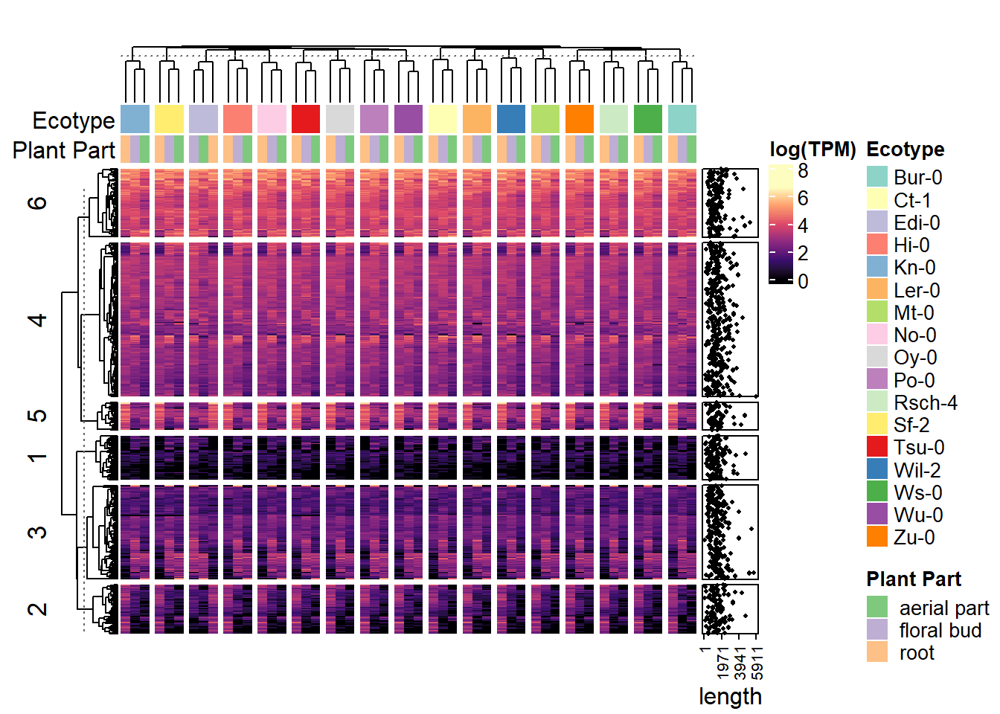

## RNA-seq Part II


::: {.cell}

```{.r .cell-code}
#if (!require("BiocManager", quietly = TRUE))
    #install.packages("BiocManager")

#BiocManager::install("ComplexHeatmap")
```
:::


Installing the necessary packages "BiocManager" and "ComplexHeatmap".


::: {.cell}

```{.r .cell-code}
#install.packages("viridisLite")
#install.packages("stringr")
#install.packages("RColorBrewer")
#install.packages("circlize")
```
:::


Installed more packages, "viridisLite", "stringr", "RColorBrewer", and "circlize".


::: {.cell}

```{.r .cell-code}
library(ComplexHeatmap)
```

::: {.cell-output .cell-output-stderr}

```
Loading required package: grid
```


:::

::: {.cell-output .cell-output-stderr}

```
========================================
ComplexHeatmap version 2.22.0
Bioconductor page: http://bioconductor.org/packages/ComplexHeatmap/
Github page: https://github.com/jokergoo/ComplexHeatmap
Documentation: http://jokergoo.github.io/ComplexHeatmap-reference

If you use it in published research, please cite either one:
- Gu, Z. Complex Heatmap Visualization. iMeta 2022.
- Gu, Z. Complex heatmaps reveal patterns and correlations in multidimensional 
    genomic data. Bioinformatics 2016.


The new InteractiveComplexHeatmap package can directly export static 
complex heatmaps into an interactive Shiny app with zero effort. Have a try!

This message can be suppressed by:
  suppressPackageStartupMessages(library(ComplexHeatmap))
========================================
```


:::

```{.r .cell-code}
library(viridisLite)
library(stringr)
```

::: {.cell-output .cell-output-stderr}

```
Warning: package 'stringr' was built under R version 4.4.3
```


:::

```{.r .cell-code}
library(RColorBrewer)
library(circlize)
```

::: {.cell-output .cell-output-stderr}

```
Warning: package 'circlize' was built under R version 4.4.3
```


:::

::: {.cell-output .cell-output-stderr}

```
========================================
circlize version 0.4.16
CRAN page: https://cran.r-project.org/package=circlize
Github page: https://github.com/jokergoo/circlize
Documentation: https://jokergoo.github.io/circlize_book/book/

If you use it in published research, please cite:
Gu, Z. circlize implements and enhances circular visualization
  in R. Bioinformatics 2014.

This message can be suppressed by:
  suppressPackageStartupMessages(library(circlize))
========================================
```


:::

```{.r .cell-code}
library(rbioinfcookbook)
library(BiocManager)
```

::: {.cell-output .cell-output-stderr}

```
Warning: package 'BiocManager' was built under R version 4.4.3
```


:::
:::


Added all newly installed packages to the library for future ease of access.


::: {.cell}

```{.r .cell-code}
mat <- log(as.matrix(at_tf_gex[ , 5:55]))
ecotype <- stringr::str_split(colnames(mat), ",", simplify = TRUE)[,1]
part <- stringr::str_split(colnames(mat), ",", simplify = TRUE)[,2]
```
:::


Use the function as part of the stringr package that allows for data to be split, in this situation, by ecotype.


::: {.cell}

```{.r .cell-code}
data_col_func <- circlize::colorRamp2(seq(0, max(mat), length.out = 6), viridisLite::magma(6))

ecotype_colors <- c(RColorBrewer::brewer.pal(12, "Set3"), RColorBrewer::brewer.pal(5, "Set1"))
names(ecotype_colors) <- unique(ecotype)

part_colors <- RColorBrewer::brewer.pal(3, "Accent")
names(part_colors) <- unique(part)
```
:::


Used the circlize and viridisLite packages to choose color palettes for the different data types in the heat map. This created a unique color palette for the different ecotypes and plant parts.


::: {.cell}

```{.r .cell-code}
top_annot <- HeatmapAnnotation("Ecotype" = ecotype, "Plant Part" = part, col = list("Ecotype" = ecotype_colors, "Plant Part" = part_colors), annotation_name_side = "left")

side_annot <- rowAnnotation(length = anno_points(at_tf_gex$Length, pch = 16, size = unit(1, "mm"), axis_param = list(at = seq(1, max(at_tf_gex$Length), length.out = 4)),))
```
:::


Added annotations to the heat map for ease of interpretation. Created top_annot to include information on Ecotype and plant part. The code annotation_name_side was used to set the annotation on the left side of the heat map to represent the color identification. The line that includes side_annot was used to add annotations to the heat map rows for the samples' length information. Function anno_points() was used to specify the plotted point locations. The line with pch determined the shape of the points. The function for size is self-explanatory and defines the size of the points. The line including axis_param sets the tick mark locations on the x-axis.


::: {.cell}

```{.r .cell-code}
ht_1 <- Heatmap(mat, name="log(TPM)", row_km = 6, col = data_col_func, top_annotation = top_annot, right_annotation = side_annot, cluster_columns = TRUE, column_split = ecotype, show_column_names = FALSE, column_title = " ")

ComplexHeatmap::draw(ht_1)
```

::: {.cell-output-display}
{width=672}
:::
:::


Now the heat map is created using the prior formatting code. The Heatmap() function as a part of the ComplexHeatmap package was used to generate the heat map, specifying the dataset as mat. The data_col_function interprets and translates the color palettes that were set previously. The code top_annot and side_annot apply the annotations that were previously formatted. The display of the plot was modified using additional code. The function row_km sets the number of clusters per row. The heatmap was formatted such that the columns are clustered based on the similarity in gene expression; This was done by setting cluster_columns to TRUE. The columns were grouped by ecotype by setting column_split to ecotype. To create a neater display, the column names were hidden by setting show_column_names to FALSE. The function column_title was set to be left blank to keep the heatmap decluttered.

Much of the heat map is difficult to interpret. I was able to identify a few patterns. Genes 3 and 2 seem to be related in that the trends in the log(TPM) are the inverse of each other, not in scale but in their relationships. In particular, in gene 3, the log(TPM) is lowest for most ecotypes in the root; conversely, for gene 2, the log(TPM) is highest in the root, so one would assume the two are inversely related.
